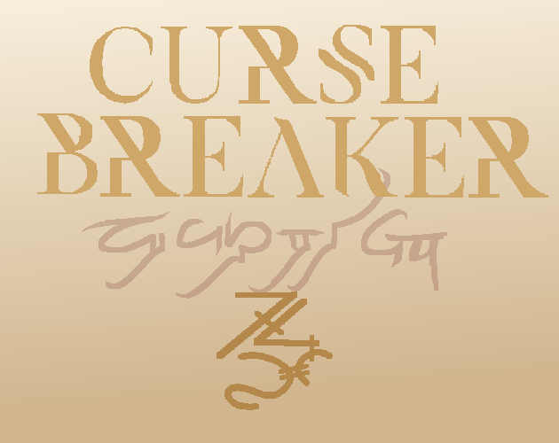

# Cursebreaker

Draw glyphs to break magical locks!

Play the game [here](https://lokhness.itch.io/cursebreaker)! Made for a spellcasting-themed game jam: https://itch.io/jam/umgmc-msj-s1-2025

The basic gameplay is drawing strokes to move a purple key on screen. On the horizontal axis, the shape determines which direction it goes (curves go left, sharps go right), and the length of the stroke is how far it moves. For the vertical axis, the width and height of each stroke is totalled, and the difference determines how far it will move up or down. Strokes with an equal width and height will not move up or down.

